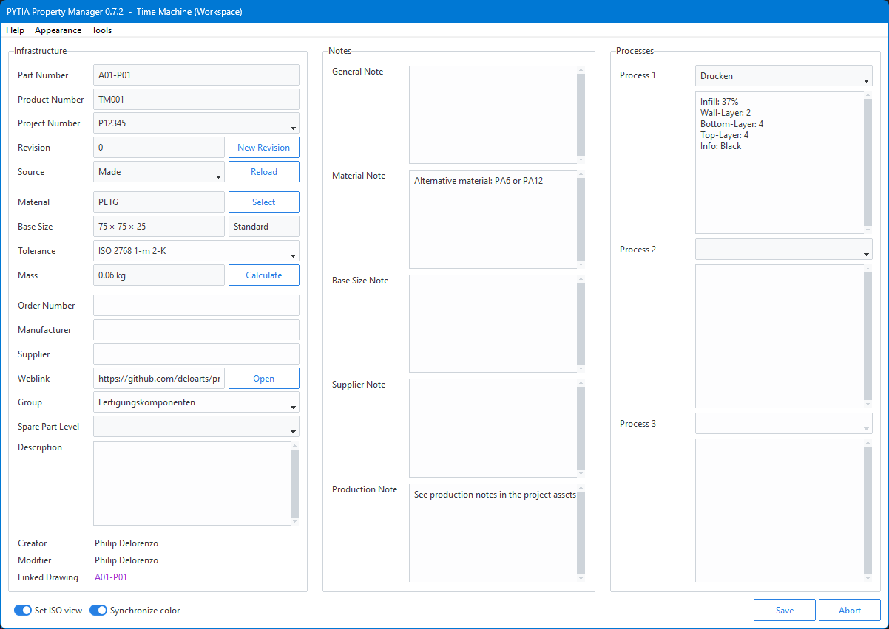
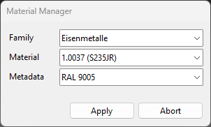
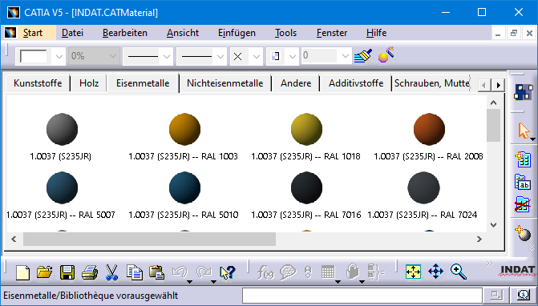

# pytia property manager

A visual tool for managing CATIA properties.


[](https://www.python.org/downloads/)


> ⚠️ The layout of this app is heavily biased towards the workflow and needs of my companies' engineering team. Although almost everything can be changed via config files and presets, the apps basic functionality is built to work in the environment of said company.

## 1 installation

### 1.1 user

On the users machine you need to install the following:

- CATIA
- [Python](https://www.python.org/downloads/)

When the user starts the app it will automatically install all its requirements. Further the app also updates outdated dependencies if needed. The apps environment will be created in the users appdata-folder: `C:\Users\User\AppData\Roaming\pytia\pytia_property_manager`

Recommended python install options for the user:

```powershell
python-installer.exe /passive PrependPath=1 Include_doc=0 Include_test=0 SimpleInstall=1 SimpleInstallDescription="python for pytia"
```

### 1.2 developer

On the developers machine (this is you) install the following:

- CATIA
- [Python](https://www.python.org/downloads/)
- [Poetry](https://python-poetry.org/docs/master/)

> ✏️ Use poetry to install all dependencies and dev-dependencies to work on this project.
>
> 🔒 Some dependencies are from private repos. You need to have [ssh-access](https://docs.github.com/en/authentication/connecting-to-github-with-ssh) to those repositories. Test your ssh connection with `ssh -T git@github.com`
>
> ❗️ Never develop new features and fixes in the main branch!

## 2 setup

### 2.1 resource files

All configuration is done via json files inside the [resources folder](/pytia_property_manager/resources/).

#### 2.1.1 default files

You can leave the default configuration if it suits your needs, but you can always copy any default json file, rename (get rid of 'default') it and edit its content.

Example: If you want to change the content of the [processes.default.json](/pytia_property_manager/resources/processes.default.json) you have to copy this file, and paste it as **processes.json**. Then you can edit the content of your newly generated processes-settings file. Same for any other default-resource file.

> ✏️ For a full description of all default files, see [docs/DEFAULT_FILES.md](/docs/DEFAULT_FILES.md).

#### 2.1.2 sample files

Files that are named like **settings.sample.json** must be copied, renamed and edited. Sample files exists only for you to have a guide, of how the config file must look.

Example: Before you can build the app you have to copy the [settings.sample.json](/pytia_property_manager/resources/settings.sample.json) and rename it to **settings.json**. Then you can edit its content to match your requirements.

> ✏️ For a full description of all sample files, see [docs/SAMPLE_FILES.md](/docs/SAMPLE_FILES.md).

#### 2.1.3 static files

Files without 'default' or 'sample' in their names cannot be changed! Just leave them there, they are needed for the app to work.

### 2.2 provide local dependencies

Some dependencies are not publicly available on PyPi or GitHub (because they are private). Therefore it's necessary to provide the wheel-file locally for the app to auto-install it. The list below shows said local deps:

Name | Link | Version
--- | --- | ---
**pytia** | <https://github.com/deloarts/pytia> | [0.1.1](https://github.com/deloarts/pytia/releases/tag/v0.1.1)
**pytia-ui-tools** | <https://github.com/deloarts/pytia-ui-tools> | [0.4.1](https://github.com/deloarts/pytia-ui-tools/releases/tag/v0.4.1)

> ❗️ The folder where you provide the local dependencies must match the **paths.local_dependencies** entry of the **settings.json**. The user must have at least read access on this folder.
>
> ✏️ Put the wheel file on a shared network drive if you have multiple users.

### 2.3 provide a release folder

To be able to launch the app from within CATIA you need to provide a release folder, where the app and a launcher file are stored. Both files (the app and the launcher) will be created with the [_build.py](_build.py) script, and released to the release-folder with the [_release.py](_release.py) script.

> ❗️ Add this release folder to the **settings.json** file as value of the **paths.release** key.

### 2.4 test

Most tests require CATIA running. Test suite is pytest. For testing with poetry run:

```powershell
poetry run pytest
```

> ⚠️ Test discovery in VS Code only works when CATIA is running.

### 2.5 build

> ❗️ Do not build the app with poetry! This package is not not meant to be used as an import, it should be used as an app.

To build the app and make it executable for the user run the [_build.py](_build.py) python file. The app is only built if all tests are passing. The app will be exported to the [_build-folder](/build/). Additionally to the built python-file a catvbs-file will be exported to the same build-folder. This file is required to launch the app from within CATIA, see the next chapter.

> ✏️ You can always change the name of the build by editing the value from the **files.app** key of the **settings.json**.
>
> ✏️ The reason this app isn't compiled to an exe is performance. It takes way too long to load the UI if the app isn't launched as python zipfile.

### 2.6 release

To release the app into the provided release folder run the [_release.py](_release.py) script.

To run the app from within CATIA, add the release-folder to the macro-library in CATIA. CATIA will recognize the catvbs-file, so you can add it to a toolbar.

You can always change the path of the release folder by editing the value from the **paths.release** key of the **settings.json**.

> ⚠️ Once you built and released the app you cannot move the python app nor the catvbs script to another location, because absolute paths will be written to those files. If you have to move the location of the files you have to change the paths in the **settings.json** config file, build the app again and release it to the new destination.

### 2.7 pre-commit hooks

Don't forget to install the pre-commit hooks:

```powershell
pre-commit install
```

### 2.8 docs

Documentation is done with [pdoc3](https://pdoc3.github.io/pdoc/).

To update the documentation run:

```powershell
python -m pdoc --html --output-dir docs pytia_property_manager
```

For preview run:

```powershell
python -m pdoc --http : pytia_property_manager
```

You can find the documentation in the [docs folder](/docs).

### 2.9 new revision checklist

On a new revision, do the following:

1. Update **dependency versions** in
   - [pyproject.toml](pyproject.toml)
   - [dependencies.json](pytia_property_manager/resources/dependencies.json)
   - [README.md](README.md)
2. Update **dependencies**: `poetry update`
3. Update the **version** in
   - [pyproject.toml](pyproject.toml)
   - [__ init __.py](pytia_property_manager/__init__.py)
   - [README.md](README.md)
4. Run all **tests**: `poetry run pytest`
5. Check **pylint** output: `poetry run pylint pytia_property_manager/`
6. Update the **documentation**: `poetry run pdoc --force --html --output-dir docs pytia_property_manager`
7. Update the **lockfile**: `poetry lock`
8. Update the **requirements.txt**: `poetry export --dev -f requirements.txt -o requirements.txt`

## 3 usage

Use the launcher (a.k.a the catvbs-file) to launch the app. On the first run all required dependencies will be installed:


After the installation the app starts automatically:



The app retrieves all information from the documents properties, except the material value, which is fetched from the applied material.

The usage itself is pretty straight forward, as long as all config files are setup properly.

### 3.1 buttons

#### 3.1.1 revision button

Increases the revision.

> Later this will also create a backup of the current document, then increases the revision. This allows a nice revision handling.

#### 3.1.2 reload button

This reloads the definition and the manufacturer. Works as long as the partnumbers' nomenclature matches the nomenclature of the **settings file**.

#### 3.1.3 select material button

This button opens the material manager.



To use the material manager, all materials must be named like specified in the **settings file**. The default looks like this:



#### 3.1.4 calculate bounding box button

This opens the [pytia bounding box app](https://github.com/deloarts/pytia-bounding-box). This requires the app to be available.

#### 3.1.5 calculate mass button

This triggers the mass calculation. For parts this is done when the app starts, but for products this must be done by hand (mass calculation takes a fair amount of time on big assemblies).

#### 3.1.6 save button

Writes the changes to the documents' properties and closes the app.

#### 3.1.6 abort button

Discards all changes and closes the app.

### 3.2 text inputs

A double click on a text input widget opens the text editor.

## 4 workspace

The workspace is an **optional** config file, that can be used to alter the behavior of the app. The workspace file is a yaml-file, which must be saved somewhere in the project directory, where the catia document, from which to manage the properties, is also stored:

```bash
your-fancy-project
├─── subfolder-A
│    ├─── product-A.CATProduct
│    ├─── part-A-01.CATPart
│    └─── part-A-02.CATPart
├─── subfolder-B
│    ├─── product-B.CATProduct
│    ├─── part-B-01.CATPart
│    └─── part-B-02.CATPart
└─── workspace.yml
```

As long as the workspace file is located somewhere in the project, and as long as this file is in the **same** folder, or any folder **above** the CATPart file, it will be used.

For a detailed description of the workspace config file, see [WORKSPACE_FILE](docs/WORKSPACE_FILE.md).

The filename of the workspace file can be changed in the **settings.json** file, see [SAMPLE_FILES](docs/SAMPLE_FILES.md).

## 5 license

[MIT License](LICENSE)

## 6 changelog

**v0.1.0**: Initial commit.  
